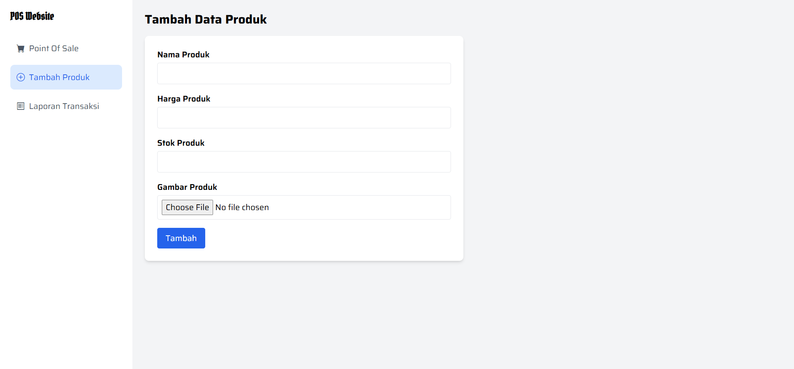
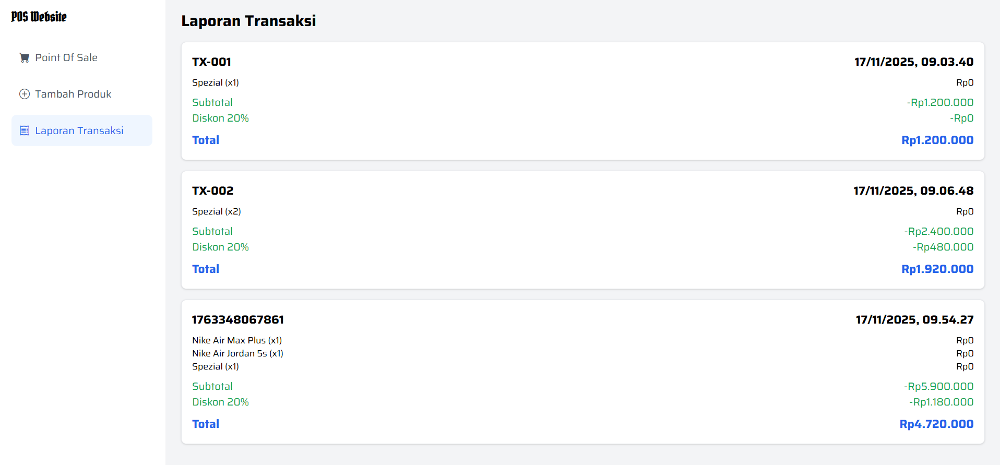

# Simple Point of Sale (POS) — HTML, TailwindCSS, Vanilla JavaScript

Aplikasi POS sederhana berbasis web dengan fitur manajemen produk, keranjang belanja, dan laporan transaksi. Seluruh data tersimpan di **localStorage**, sehingga tetap aman meski halaman di-refresh.

---

##  Fitur Utama

### **1. Manajemen Produk**

* Tambah produk (nama, harga, stok, dan gambar).
* Stok otomatis berkurang saat produk masuk keranjang.
* Produk dengan stok habis tidak dapat ditambahkan lagi (muncul alert *“Stok Habis”*).

### **2. Keranjang Belanja**

* Tambah item ke keranjang.
* Update jumlah item (tambah/kurangi).
* Hapus item dari keranjang.
* Diskon otomatis **20%** jika total item ≥ 2.
* Stok bertambah kembali jika item dihapus atau qty dikurangi.

### **3. Checkout & Laporan Transaksi**

* Proses checkout menghitung subtotal, diskon, total.
* Transaksi tersimpan otomatis ke halaman laporan.
* Laporan dapat dilihat kapan saja tanpa refresh data.

---

## Cara Penyimpanan Data (State Storage)

Data disimpan dalam **localStorage** dengan tiga state utama:

### **1. products**

```js
{
  id: number,
  name: string,
  price: number,
  stock: number,
  image: base64
}
```

### **2. cart**

```js
{
  id: number,
  name: string,
  price: number,
  qty: number
}
```

### **3. transactions**

```js
{
  id: number,
  date: string,
  items: [...cart],
  subtotal: number,
  discount: number,
  total: number
}
```

Helper:

* `getData(key)` → ambil data
* `saveData(key, data)` → simpan data

---

##  State Management

### **Produk**

* Tambah produk → disimpan ke `products`
* Kurangi stok saat addToCart
* Kembalikan stok saat qty dikurangi atau item dihapus
  Render ulang:

```js
renderProducts();
```

### **Keranjang**

* Operasi: `addToCart`, `changeQty`, `removeFromCart`
* Otomatis menyesuaikan stok produk
  Render ulang:

```js
renderCart();
```

### **Transaksi**

* Dibentuk saat checkout
* Disimpan ke `transactions`
* Keranjang dikosongkan
  Render ulang:

```js
renderTransactions();
```

---

##  Navigasi Halaman

Navigasi menggunakan fungsi:

```js
showPage(page)
```

Hanya menyembunyikan/menampilkan `<section>` tanpa routing tambahan.

## Tampilan Aplikasi

### Halaman Utama


### Halaman Tambah Produk


### Halaman Laporan Transaksi


## Kendala Yang Ditemukan Pada Saat Pengerjaan
Kendala: Laporan transaksi tidak ter-render

Saat membuka halaman report, data transaksi tidak muncul sama sekali.
Beberapa error yang muncul:

renderTransactions is not defined

getTransactions is not defined

Cannot read properties of undefined (reading 'toLocaleString')

✔ Penyebab Utama

Fungsi renderTransactions dan getTransactions tidak berada di scope global sehingga tidak bisa dipanggil oleh showPage().

Pada proses checkout, data transaksi disimpan menggunakan:

transactions.push(Transaction); // SALAH


yang menyebabkan object transaksi sebenarnya tidak pernah tersimpan.

Ada item transaksi yang tidak memiliki properti subtotal, sehingga toLocaleString() memunculkan error.

✔ Solusi yang Diterapkan

Memindahkan fungsi renderTransactions() dan getTransactions() ke scope global, sehingga dapat dipanggil dari mana saja.

Memperbaiki proses penyimpanan transaksi, mengganti:

transactions.push(Transaction)


menjadi:

transactions.push(newTransaction)


Memperbaiki struktur data item, sehingga setiap item memiliki nilai price, qty, dan subtotal.

Menambah fallback:

(i.price * i.qty).toLocaleString("id-ID")


jika subtotal tidak tersedia.

Dengan perbaikan ini, halaman laporan transaksi akhirnya dapat menampilkan seluruh riwayat transaksi dengan benar.
